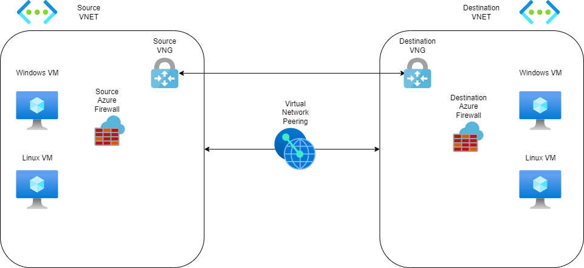

Lab environment for testing connectivity between Virtual Machines in separate Virtual Networks.

Optional configurations are as follows:
Same Region or multi Region
Virtual Network Gateway or Virtual Network Peering connection
Azure Firewall
Windows or Linux Virtual Machines

You may either clone this repro and deploy with Bicep or use the easy deploy below:

Diagram of the infrastructure with all optional components

Note: This Diagram is in this repository, and can be modified via https://app.diagrams.net/